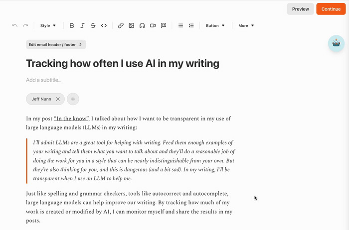

# Substack AI Transparency Tracker

A Chrome extension that helps writers track and mark AI-generated or AI-modified content in their Substack posts. A useful too for providing transparency about AI usage with detailed statistics and annotation management.

## Features

- **🎯 Sidebar Interface**: Google Docs-style sliding sidebar for AI content management
- **📝 Clean Text Selection**: Zero DOM modification - original document completely untouched
- **🖱️ Native Right-Click**: Browser's native context menu works normally
- **📊 Live Statistics**: Real-time tracking of total words, AI words, and percentage
- **💬 Annotation Management**: View, edit, and delete AI annotations in the sidebar
- **💾 Persistent Storage**: AI markings persist across page refreshes, keyed by unique post ID
- **🔄 Auto-Cleanup**: Automatically removes annotations when AI content is deleted from post

## Installation

### Development Mode (Recommended for testing)

1. Download or clone this repository
2. Open Chrome and go to `chrome://extensions/`
3. Enable "Developer mode" in the top right
4. Click "Load unpacked" and select the folder containing the extension files
5. The extension should now appear in your extensions list

## How It Works

### 🎯 Core Approach: Zero DOM Modification

Unlike traditional highlighting approaches that wrap text in HTML elements (causing selection issues), this extension uses a **sidebar-based tracking system** that never modifies the original document structure.

### 📱 User Interface

1. **Floating AI Button**: A button appears in the top-right corner of Substack editor pages
2. **Slide-out Sidebar**: Click the button to open a Google Docs-style sidebar
3. **Selection Detection**: When you select text, the sidebar automatically shows marking options
4. **Annotation Management**: All AI annotations are listed and manageable in the sidebar

## Usage

### Opening the AI Tracker

1. **Navigate to a Substack editor page** (create or edit a post)
2. **Look for the 🤖 button** in the top-right corner
3. **Click the button** to open the AI Tracker sidebar

### Marking AI Content

**Method 1: Mouse Selection**

1. **Select any text** in your post
2. **Sidebar automatically shows** selection options
3. **Click "Mark as AI"** to track the text as AI-generated
4. **Click "Mark as Human"** to remove AI marking

### Viewing Statistics

The sidebar displays:

- **Total Words**: Complete word count of your post
- **AI Words**: Number of words marked as AI-generated
- **AI Percentage**: Percentage of content that is AI-assisted
- **Annotation List**: All AI annotations with preview text

### Managing Annotations

- **View Details**: Each annotation shows preview text, word count, and date
- **Remove Annotations**: Click the × button next to any annotation

## Browser Compatibility

- **Chrome**: Full support (primary target)
- **Edge**: Compatible with Chromium-based versions
- **Firefox**: Requires manifest conversion for full compatibility

## Privacy

- **Local Storage Only**: All annotation data stored locally in your browser using localStorage
- **Post-Specific Storage**: Each Substack post gets its own storage key based on unique post ID
- **Persistent Across Sessions**: AI markings automatically saved and restored when you return to a post
- **No External Servers**: No data transmission to third parties
- **User Control**: Complete control over your annotation data
- **Transparent Operation**: Open source code for full transparency

## Troubleshooting

### Extension not working on Substack?

1. **Check URL**: Make sure you're on a Substack editor page (URL contains `/p/` or `/edit`)
2. **Refresh page**: Reload the page after installing the extension
3. **Check permissions**: Verify extension is enabled in `chrome://extensions/`
4. **Look for button**: The 🤖 button should appear in the top-right corner

### Sidebar not opening?

1. **Click the 🤖 button** in the top-right corner
2. **Check console**: Open browser dev tools for any error messages
3. **Reload extension**: Disable and re-enable in `chrome://extensions/`

### Selection not detected?

1. **Select text normally**: Use mouse or keyboard to select text
2. **Check sidebar**: Selection options should appear automatically
3. **Ensure sidebar is open**: The sidebar must be open to see selection options

## Contributing

This project is open source and welcomes contributions. The current focus is on:

- Improving the sidebar interface stability
- Improving text selection
- Enhancing user interface system
- Expanding browser compatibility

## License

This project is open source and available under the MIT License.

---

**Note**: This extension is designed specifically for transparency in AI-assisted writing. It helps writers be honest with their readers about which parts of their content were generated or modified by AI tools, promoting ethical AI usage in content creation.
